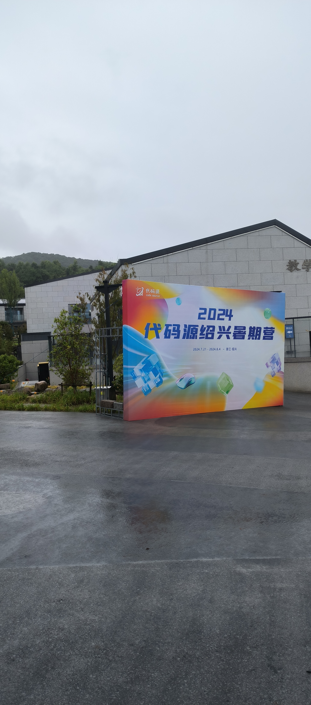
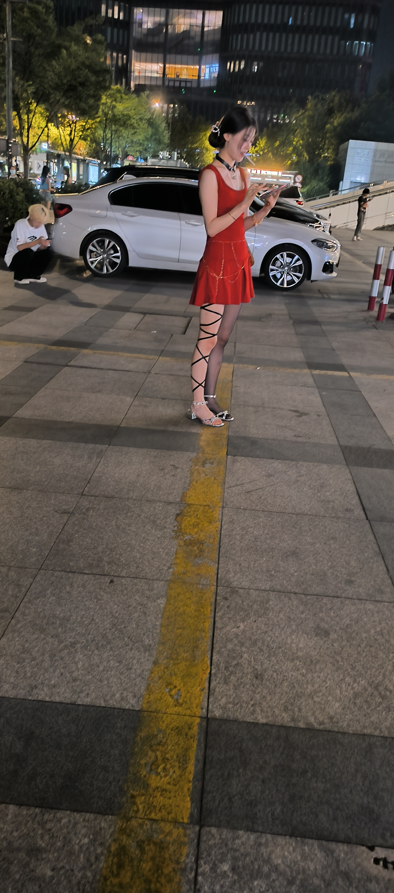

# 2024 Namomo summer camp 集训

## Day1 数据结构 Heltion 主讲

### Part1 经典板子题

先教了一些近似 $O(N)$ 求区间最小值和LCA等科技 ， 感觉很useless

然后是通过抽象代数的角度去解释线段树 ， 貌似高手都喜欢用抽象代数那一套去解释数据结构

个人听懂的就只有两个经典科技

- 重链剖分加线段树维护树上路径信息的经典科技  
- 点分治解决树上点对问题

之后的内容 个人能力有限到这里就放弃思考了

1. 使用李超线段树 ， 将一些问题转化为处理二维平面的直线
2. 一些数据结构和计算机几何结合 ， 关于凸包和AC自动机

### Part2 分治与分块内容选讲

分治问题主要是以树上问题为代表 ， 分块问题比较杂

这次集训比较好的强化了分块的意识 ， 平时cf训练没怎么遇到过分块

分块问题在之后的几个专题也有涉及到 , 感觉最近几场牛客多校这是个相对热门的问题 ， 一些常规数据结构难以维护的东西貌似都可以向分块的方向上靠一靠

## Day2 以交互题为主的博弈论 Heltion 主讲

这一天给出的题很不想补 ， 交互题测样例比较麻烦 ， 可能需要自己另外写一个程序当交互机

区预赛的不像cf ， WA1也罚时

交互题的一些烂套路

- 博弈论 ， 评测机作为对手
- 限定询问次数
- 给定一些隐藏的序列 ， 提出询问并进行猜测

貌似这节课刚上完当晚的 `Div1+2` E题就出了个博弈论 ， 比当晚的阴间D题好做很多，两道题都是和二分图有关的 ， 但是E的性质很好往二分图方面想

博弈论很考察性质观察能力和构造能力 ，和交互题结合起来能搞得很恶心 ，不好想也不好写

## Day3 图论为主 Tsu有手有脚的lk主讲

这一天的科技学会了个tarjan全家桶 ， 然后在牛客多校就用到了

构造了一个很对的做法 ， 还差临门一脚踹进去 ， 但是航哥抛了个假结论 ，然后两人都烙上了思想钢印 ，之后两小时就开始发病了

讲了很多平时没见过的科技，在这里列举几个

- 斯坦纳树
- 树哈希
- 传递闭包
- 点分治边分治
- 网络流全家桶
- 最小树形图
- 2SAT

但是给出的例题都是CF上的 ， 基本上不沾什么科技 ， 和lk的授课内容比较割裂吧 ， CF补题比Heltion给的library checker上的题目好很多，这个oj判题很慢 ，交一发判2h ，人多的时候处于不可用状态

## Day4 阴间数学 lk主讲

起手多项式卷积 , 十分哈人 ， 感觉大家对卷积这个数学工具掌握的很熟练 ， 但我不懂 ， lk在课上就这样卷一下，那样卷一下，卷麻了

列举几个课上的科技，感觉大家都懂，但我不懂

- 积性函数常见性质，以及常见的积性函数
- 数论卷积
- 莫反，这个不算冷门，但我不会
- 中国剩余定理，感觉和莫反一样，大家都听过，但是实际没用过
- 生成函数
- DFT ， FFT ， NTT ， 多项式全家桶 ， 不会
- Stein , BSGS , Pohlig-Hellman , Pollard-Rho , Miller-Rabin ，这些基本没听过

## Day5 DP 施韩原主讲

这一天基本都是讲网友投稿的区域赛例题 ， 比较能听得懂

学了几个套路

- 一个题目给定的是一些关于度数的限定条件 ， 尝试把每条无向边定方向 ， 能够有很好的性质
- 可以尝试根据分块的思想来分类讨论DP ，比如根据点的度数进行分块 ， 加速状态方程转移 ， 牛客多校好像就挺喜欢这样的
- 分块的时候取块长 ， 根据  $AM-GM$  不等式 ， 如果有log的话记得取 $\sqrt{ Nlog(N) }$
- 3元环计数问题 ， 去年深圳好像有道签到题是这个的

## Day6 区域赛命题解析 dls主讲

主要吹水为主

- 偷鸡可以选新开的赛区 ， 比如今年的上海 ， 但是要承担像去年澳门和合肥主办方发病出事故的风险
- 南京还是比较稳健的 ， 但是肯定还是诸神黄昏 ， 大家都喜欢出题组比较正常的赛站
- 沈阳dls评价比较狂野，会有很icpc和oi的两极风格题目 ， 出了放在cf上的肯定会被喷的那种
- dls评价线段树为金牌题科技 ， 因为金牌题都不考线段树
- 不需要会什么算法就银牌题了 ？ 此点有待考察

---

哦还和航哥去杭州逛了童锦程开的酒吧，但是舍不得几千块钱的卡座就没进去看了 ， 穷鬼感觉过不起纸醉金迷的生活

