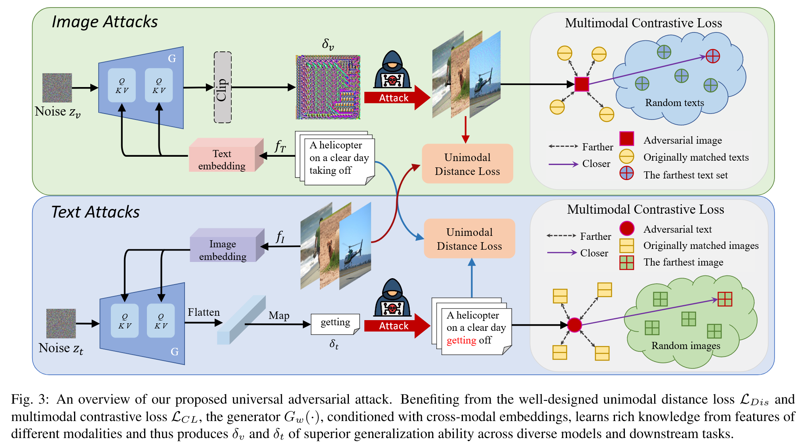
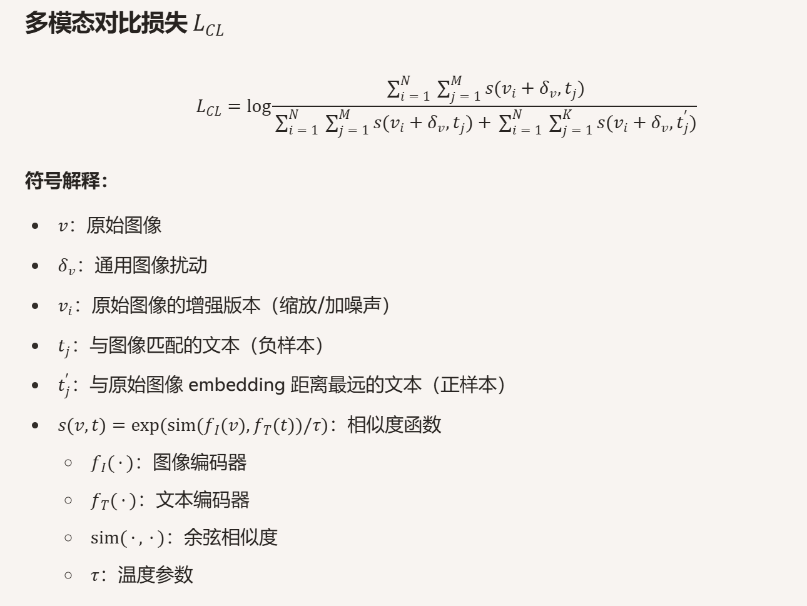
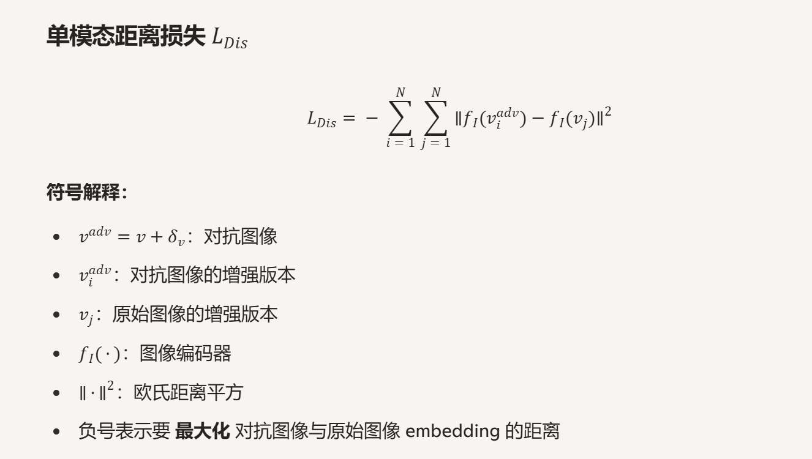

# 多模态模型Hack研究LOG

## 文本 + 图像 类多模态模型

初步idea是挑选一个输入RGB信息和Depth信息的模型然后在上面做实验

需要了解主流多模态模型是怎么做信息融合的

先挑选一些参数量小的模型，便于快速验证学习

由于对多模态模型了解比较少，所以类似与CLIP等比较经典的东西也可以看一看，学学怎么设计多模态的损失函数

### CLIP 模型

把图像vec和单词vec投射到一个空间上，让符合的图像和单词pair在空间中尽可能匹配

用余弦相似度计算损失函数 ， 忽略向量模长，只考虑方向（即向量的语义信息）

按列做softmax + 按行做一次softmax 然后做交叉熵算损失函数 ，这样模型能够按图片找文字也能按文字找图片

总结：CLIP通过维护相似图像向量和文本向量在统一特征空间下指向方向一致性，达到多模态信息融合目的。

### 一些常见的 多模态（图文俩模态）损失函数设计

ITC : CLIP使用的方法

ITM ：把图文一起送到多模态transformer里做cross att之后，把吐出来的cls token做二分类判断图文是否匹配

MLM : 把文本随机mask掉，让模型通过图像信息对文本信息做完形填空

**idea!**
感觉除了MLM不太好实现，ITC和ITM的方法也能放在 RGB 和 Depth 模态的模型里 ， 无非是把文本信息换成Depth信息，然后做匹配而已。

### ALBEF

做的工作其实就是用CLIP把文本token和图像token先投射到同一个特征空间下进行对齐

使用self-distilation方法改善训练数据noisy问题

12层图像编码 ， 6层文本编码 ， 6层特征融合

特征融合部分用 ITM 和 MLM ， ITM 的 hard negative样本使用前面类CLIP部分得到的余弦相似度较高的样本进行训练

### VLMO

使用类MoE架构，FFN 分三类权重 ，V、L、VL，分别用来专门处理图像、文本、特征融合，根据下游任务不同选择性激活

先用NLP和CV领域大型数据集pre-train V和L ，然后用多模态数据集训练VL

一个有意思的现象 ： 第一步现在vision上pre train ， 然后把 mha权重froze再pre train文本，效果不错。但是反过来就不太行，可能说明视觉这一块包含的信息熵还是很多，需要比较多的模型参数去处理视觉信息。

### BLIP

ALBEF团队做的进一步工作

基本上就是ALBEF基础上 ITM + MLM + LM 三种loss

Bi-Self-att/Causal-Self-att(做LM的时候由于不能看后面的token所以得换成Causal) -> Cross-att(做ITC的时候关闭) -> Feed-Forward

使用bootstrapping方法左脚踩右脚上天

先用noisy data预训练一个BLIP ，然后用一部分干净的dataset fine-tune出来一个captioner和filter，用来生成大量干净数据,用新的数据集再pre-train一个BLIP

左脚踩右脚上天这一块

### CoCa

使用Decoder Only ，全都用的Causal att，避免多次forward从而加快训练速度

### BEIT v3

就是一个VLMO，不过统一一个MDM作为Loss function去做scale up

把图像切成token之后同样看成一门语言然后和文本信息去做处理

#### 总结

由于对多模态模型不太熟悉所以扫了一遍 text 和 vision的多模态模型

大部分方法都是全部基于transformer token体系下的架构，就是把text token 和 vision token放进去一块过mha

接下来看看CNN架构的多模态模型，CNN的多模态应该就是都是基于图像信息RGB Depth等模态做的工作了

---

## RGB-D信息融合方式

1. early fusion 直接拼成4通道或者HHA编码拼成6通道送进CNN里面卷

2. feature-level-fusion 先用独立的模型抽特征，抽完送到中间层做通道拼接或者加权求和

3. multi-stage fusion 模型 低层 中层 高层 都做融合

## 对抗样本攻击方式 (大部分基于梯度)

之前做的都是infra类型的工作，跨到模型攻防这一块步子迈大了感觉扯到蛋了

但是学过eecs498（cs231n加强版本）基本的CV这一块的东西还是懂的七七八八来着。

先扫一眼关于这方面的[综述文献](https://arxiv.org/abs/1712.07107)看看常用hack模型的方法

### Optimized Perturbation

将寻找的对抗样本和原始样本之间的扰动写成损失函数的形式

将对抗样本的模型输出和GT也做一个损失函数

将问题转变为一个数学优化问题，使用SGD等方式可构造出来

### Constraint Peturbation

依然将扰动写成损失函数，但是只要扰动在可接受范围内，损失归位0

### FGSM 经典攻击算法 ~~熊猫小图片这一块~~ 

x_adv = x + epsilon * sign

其中sign 为 Loss 的梯度方向

Loss即一个设计让模型预测失败的交叉熵

### I-FGSM 加一个alpha超参数多次迭代

### PGD 多次迭代的时候设定超参数epsilon，扰动超过了就投影回去

总结：接着再看了一些R+FGSM、MI-FGSM,基本上就是把深度学习训练模型常见的一些方法拿到生成对抗样本上来（动量法、随机噪声等）

### JSMA 求导雅可比矩阵，对应梯度高的像素优先扰动，根据梯度信息构造显著性分数，对显著性分数高的像素做一个小幅度扰动，依次迭代

### DeepFool

假设线性分类器决策边界是一个超平面，那么最小扰动就是样本到超平面的垂直距离

推广到非线性模型中

假设有k个类别，那么就有k-1个超平面，使用一阶泰勒展开近似，选择距离最近的那个超平面走去，依次迭代生成对抗样本

### C&W 攻击

依然是类似FGSM攻击，基于梯度

将扰动的大小使用一个范数约束，而不是设置一个epsilon超参数控制

通过一个参数c * loss 来训练一个对抗样本

c使用二分搜索确认 ，loss用于让模型错误分类，设计自由度较大

### ZOO攻击（黑盒）

相当于黑盒版本的CW

使用对称差商的方式估计梯度对构造的样本进行更新

每次仅查询少量像素减少计算量，使用Adam优化器更新样本

先把图像分辨率降低，优化完成之后再插值升高减少计算量

先粗尺度攻击，在32x32得到粗略攻击方向，再放大64x64优化边缘纹理，最后放大224x224微调

图像切割为若干个patch，使用估计的梯度大小和扰动幅度刻画patch的重要性，然后优先更新关键像素

### 通用扰动（Universal Adversarial Perturbation, UAP）

在一个数据集里遍历样本，对于一个样本使用DeepFool算法找到最小扰动ri，然后把ri加到总扰动v中

假设总扰动v范数大于epsilon，则投影回去，与PGD的手法类似

### 使用GAN等生成网络生成对抗样本

先训一个生成器，输入latent variable z ， 吐出自然图片

训一个inverter，把自然图片映射回latent space

再latent space里面做扰动，让添加扰动的latent variable进入生成器后生成对抗样本

### 可迁移攻击

让生成的对抗样本在多个模型上有效，从而让对抗样本具有可迁移性

## Patch 类型攻击/防御

打算看看 Revisiting Adversarial Patch Defenses on Object Detectors (ICCV 2025) 这篇论文

构建了一个数据集APDE，用于给对抗patch 攻击防御方法做benchmark

使用白盒攻击构造patch，基于11种目标检测器做训练

给出了mIoU作为Defence性能的评价metrics

NAP类型的补丁高频信息跟非NAP类型的差不多，但是FID-Score不同，数据分布差异较大

---

看了看Adversarial Patch这篇patch攻击的奠基论文

对Patch加了EoT（一些随机的旋转缩放），并且随机放置patch位置，让patch在各个场景下都有效

剩余的训练优化patch过程就比较常规了

## 针对目标检测的攻击

Adversarial Examples for Semantic Segmentation and Object Detection 打算看看这篇论文

设计一个损失函数，loss = gt_logits - fk_logits , 即正确类别和错误类别的差值，达到压低正确率，提高错误类别分数的目的

对生成的扰动归一化后 乘以 gamma = 0.5 , 对梯度缩放 , 因为不同目标的梯度差别较大

最后的扰动是所有梯度的加和

存在问题：添加完扰动之后RPN生成的候选框可能会更改，所以会攻击失败

解决方法：

1. 将NMS提高到0.9，让训练的时候适应更多的候选框
2. 筛选候选框，与最近的真实目标的 IOU > 0.1 and 对应真实类别的置信度 > 0.1 ， 其余框框丢弃

与其他方法不同的是，作者并没有把扰动的范数加入loss，原因是梯度缩放已经替代了这一功能，所以最后的扰动人类也无法感知。

有意思的一点是把不同模型的r相加在一起攻击性能没有降低并且得到了很好的泛化性能，同时依然无法被人类感知，作者的解释是不同的扰动r是正交的

---

打算再看看DPATCH这篇论文

然后再看看几个攻击RGB-D模型的论文，查看现有攻击思路

Dpatch 的放置位置不影响攻击效果（不管是固定左上角或者随机放置）

补丁大小越大攻击效果越好

targeted攻击将目标类别设置为cow或者tv效果最好，和设置为其他类别有显著差异

该方法同时具有跨数据集和跨模型攻击能力

Dpatch的原理就是强行吸引检测器的ROI，让检测器的注意力都吸引到patch上。

---

打算再看看On Physical Adversarial Patches for Object Detection这篇论文，看看怎么能攻击自动驾驶（让研究落地到物理世界）

### 显著性检测任务，目前挑选了以下几个模型

D3Net（深度去噪思路，适合验证攻击是否能绕过鲁棒性设计）

三分支结构：RGB + RGB-D + D

每个分支使用 VGG16 作为backbone 加上 FPN(直接contatenation，不是传统addition)

使用一个DDU控制是否使用Depth信息，如果RGB输出的特征与Depth输出特征差异过大，则关闭Depth

---

JL-DCF（学术界引用量最高，benchmark 常用 baseline）

BBS-Net（轻量化，工业界常用，能体现应用价值）

### 目标检测任务

再议

### 尝试搭建D3Net模型并使用 ART 框架 进行攻击

- 最小化 L-rgb = BCE(S_rgb,GT)
- 最小化 L-depth = BCE(S_depth,GT)
- 最大化 L-rgbd = BCE(S_rgbd,GT)

---

## One Perturbation is Enough: On Generating Universal Adversarial  Perturbations against Vision-Language Pre-training Models(CVPR)

  

搞一个生成器模型G ，去生成通用的一个噪声扰动 ， 能加到各种样本里面

假如需要生成图像的扰动 ，G是一个transformer ， kv是image信息，q就是与其配对的文本信息，通过Q做cross-att,这样生成出来的噪声做到所谓的跨模态攻击

  

  

文本模态对抗样本相似 ，Token 替换策略：

1. 遍历句子中每个词
2. 计算“去掉该词”后句子 embedding 与原句 embedding 的差异。
3. 选择影响最大的词作为替换目标。(仅替换一个token)
4. 用生成器输出的 adversarial token 替换该词。

## VLATTACK: Multimodal Adversarial Attacks on Vision-Language Tasks via Pre-trained Models(NIPS)

同样是基于把两个模态的余弦相似度推远来做

### 补一补 BERT attack的知识

1. 选通过mask掉token , 出最能影响输出结果logits的topk个token
2. mask掉的token用BERT求出替换token的candidate集合 ， 如果mask掉的token是被BPE分词切碎的，需要做进一步子词处理
3. 句子相似约束，保证替换token和原token余弦相似度匹配
4. 做贪心重复进行，直到达到hack目的停止

### 补一补BSA算法

BSA（Block-wise Similarity Attack）是 VLATTACK 提出的图像攻击方法。

它的核心思想是：不依赖下游模型的梯度，而是直接在预训练视觉-语言模型的中间层特征空间中，最大化原图与扰动图的差异，从而破坏图文通用表示，实现可迁移的黑盒攻击。

  

---

VLATTACK的思想

交替更新图像和文本扰动，让两者相互配合

流程：

1. 从文本攻击阶段得到一批候选文本扰动 , 按语义相似度排序。
2. 将剩余攻击步数平均分配给这些候选。
3. 对每个候选文本 ，在其指导下使用BSA算法继续优化图像扰动
4. 更新后检查 ， 成功则停止，否则继续下一个候选。

## Transferable Multimodal Attack on Vision-Language Pre-training Models(2024 IEEE Symposium on Security and Privacy)

  

## 尝试使用PGD攻击Dformer

目前的想法是仅使用RGB攻击的方式达到我的目的 ， 将RGB模态与其他模态做attention的时候，把余弦相似度推远，同时再加入别的损失函数。

  

  
