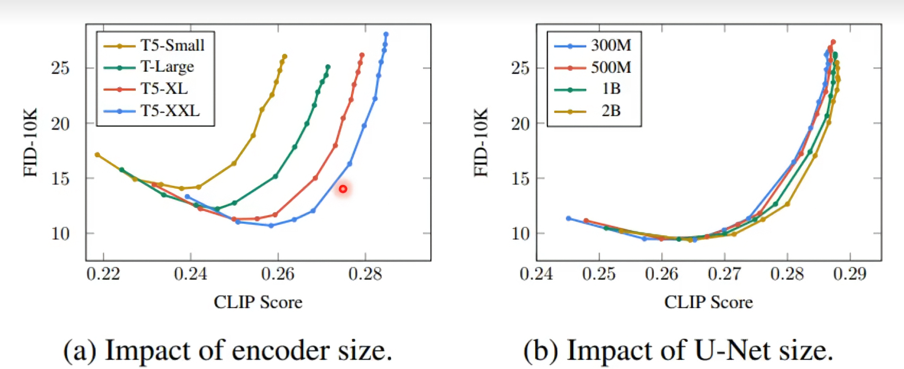
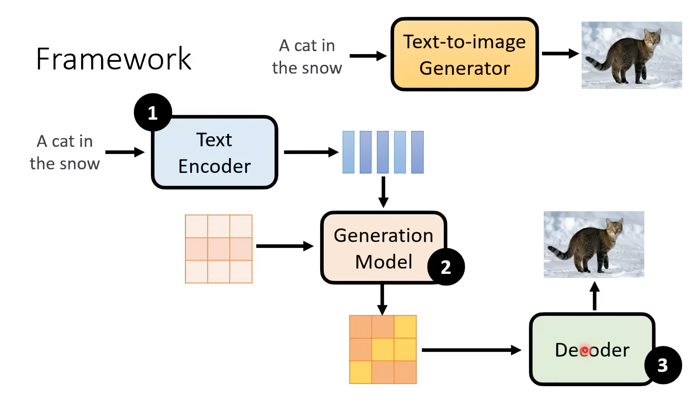
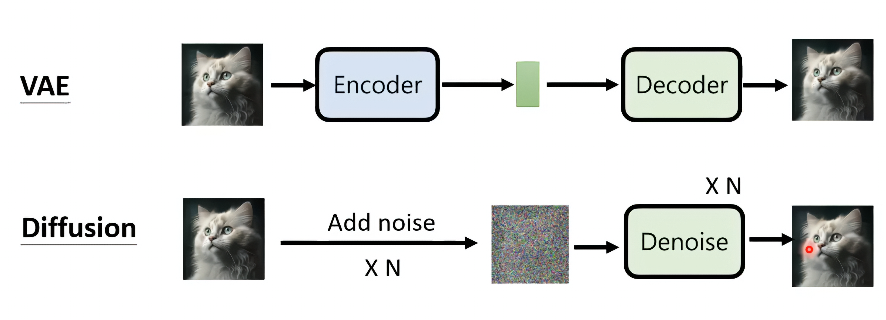
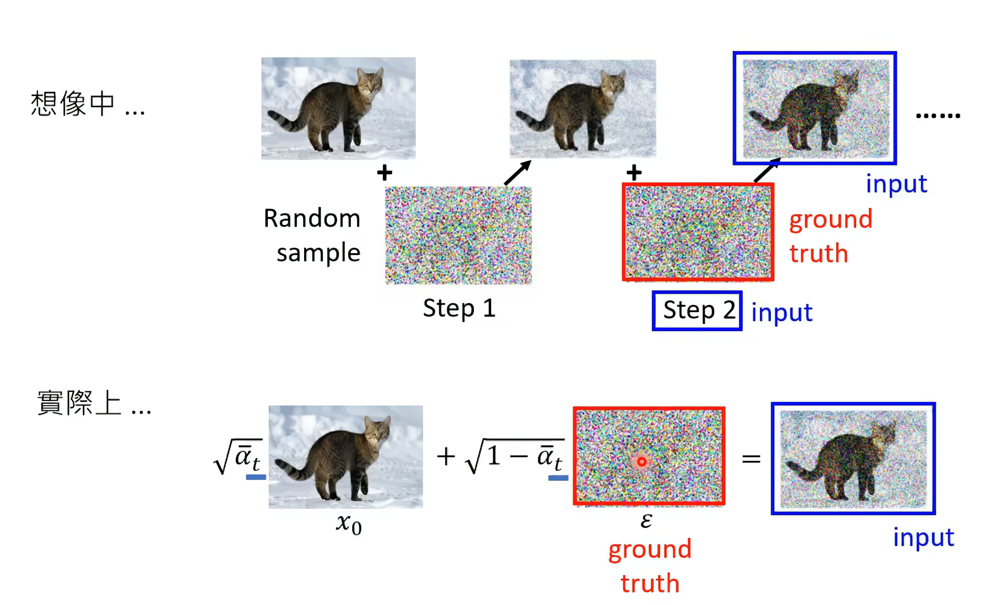
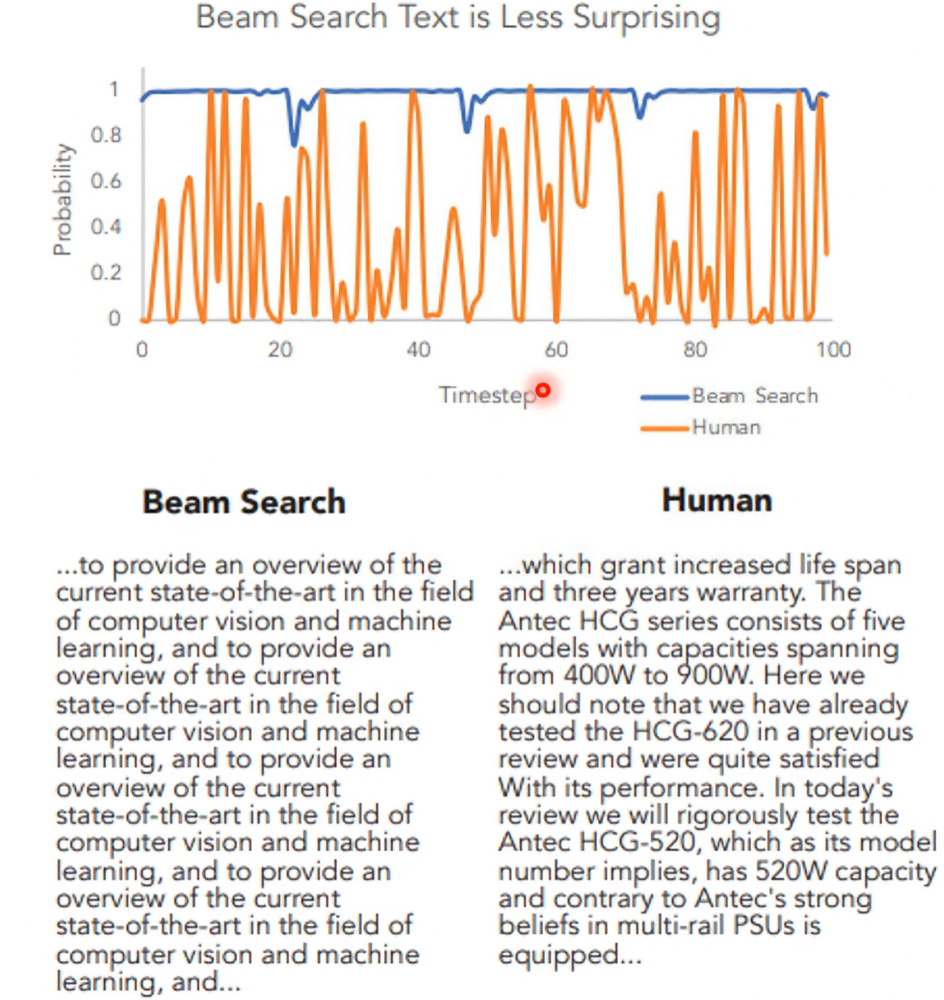
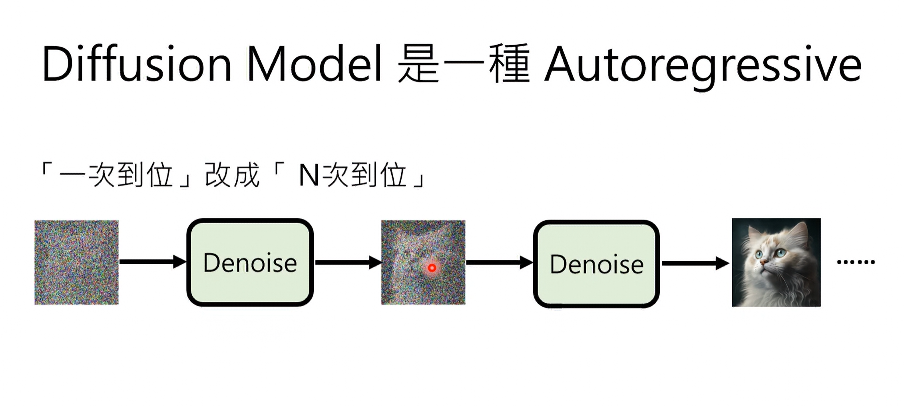
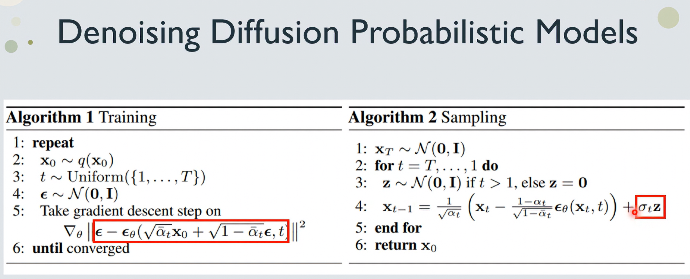

# 扩散模型学习

## text encoder and noise predictor 对模型性能的影响

  

note that , 图片生成质量常用FID 与 CLIP score来量化

## 主流image generation模型常见架构

  

note that, Generation Model一般用diffusion model来做

## 如何将VAE和diffusion 串联理解起来

  

VAE的encoder输出是一个latent variable(刻画d维高斯分布参数)

Diffusion 加噪声的过程也可以理解为在做encoding ， 输出加完噪声的图片也是 latent variable

## DDPM 算法

### encoding 过程

  

### decoding 过程

  

---

生成模型在做sampling的时候并不会选取几率最大的那个prediction 。 例如在GPT中如果这么做，那么就会一直重复说一样的话

  

同理对于diffusion model来说，我们也需要随机的sampling

  

  
