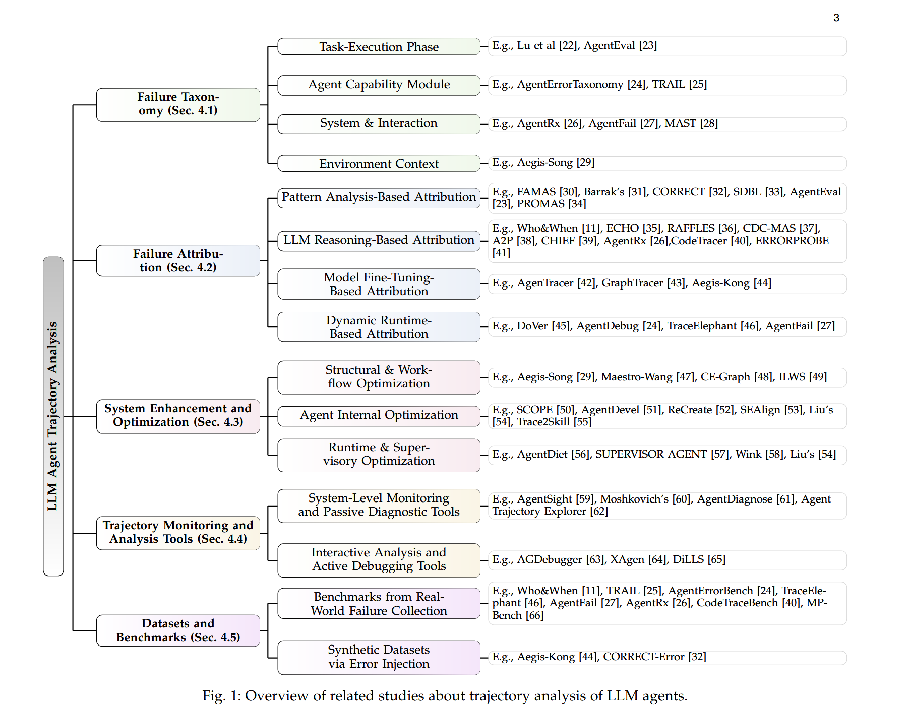

## 阅读列表

- [阅读列表](#阅读列表)
- [Anthropic Agent building 基础](#anthropic-agent-building-基础)
  - [给出了anthropic的agent building的基础框架 :](#给出了anthropic的agent-building的基础框架-)
  - [agent 不同于传统的 llm workflow](#agent-不同于传统的-llm-workflow)
- [A](#a)
- [FlowSearch: Advancing Deep Research with Dynamic Structured Knowledge Flow](#flowsearch-advancing-deep-research-with-dynamic-structured-knowledge-flow)
  - [基本信息](#基本信息)
  - [研究背景与问题](#研究背景与问题)
  - [方法总览](#方法总览)
  - [关键图表记录](#关键图表记录)
  - [我的理解与思考](#我的理解与思考)
- [Actions Speak Louder Than Prompts: A Large-Scale Study of LLMs for Graph Inference](#actions-speak-louder-than-prompts-a-large-scale-study-of-llms-for-graph-inference)
  - [基本信息](#基本信息-1)
  - [研究背景与问题](#研究背景与问题-1)
  - [方法总览](#方法总览-1)
  - [关键图表记录](#关键图表记录-1)
  - [我的理解与思考](#我的理解与思考-1)
- [PPO 算法](#ppo-算法)
  - [符号约定](#符号约定)
  - [目标 ： 希望最大化期望 reward](#目标--希望最大化期望-reward)
  - [存在问题](#存在问题)
  - [importance sampling](#importance-sampling)
  - [强化学习 bg review](#强化学习-bg-review)
    - [为什么要给 policy 套一层 log？](#为什么要给-policy-套一层-log)
- [Data pipeline](#data-pipeline)
  - [A Survey for LLM Agent Trajectory Analysis:  From Failure Attribution to Enhancement](#a-survey-for-llm-agent-trajectory-analysis--from-failure-attribution-to-enhancement)

## Anthropic Agent building 基础

[building effective agents](https://www.anthropic.com/engineering/building-effective-agents)

### 给出了anthropic的agent building的基础框架 :

1. 有一个用户输入
2. 能向外部检索信息输入、调用工具
3. 有一个记忆系统

### agent 不同于传统的 llm workflow

如果一个任务能够明确拆分为一个个步骤，那么就不需要agent，直接写成workflow就好了

给出了几种workflow范式

1. Prompt Chaining：提示词链
   把一个任务拆成多个顺序步骤，每一次 LLM 调用处理上一步的输出。中间可以加入程序化检查，判断结果是否合格。

适合：任务可以清晰拆解成固定子任务，并且每个子任务单独解决更容易。

例子：

先生成营销文案，再翻译成另一种语言；
先写文档大纲，检查大纲是否符合要求，再根据大纲写正文。

2. Routing：路由
   先把输入分类，然后分发给不同的后续流程、prompt 或工具。这样可以针对不同类别优化不同流程，而不是用一个大而全的 prompt 处理所有情况。

适合：输入类型差异明显，且分类比较可靠。

例子：

客服问题按“普通咨询 / 退款 / 技术支持”分流；
简单问题交给更便宜的小模型，复杂问题交给更强模型。

3. Parallelization：并行化
   让多个 LLM 调用同时处理任务，然后用程序聚合结果。并行化有两种典型方式：

Sectioning：把任务拆成独立部分并行处理；
Voting：让多个模型调用从不同角度给出结果，再投票或聚合。
适合：子任务可以并行，或需要多个独立判断提高可靠性。

例子：

一个模型处理用户请求，另一个模型单独做安全审查；
多个模型从不同角度审查代码漏洞。

4. Orchestrator-Workers：编排器—工人模式
   由一个中心 LLM 充当编排器，动态拆解任务，分配给多个 worker LLM，然后汇总结果。

关键区别：它和普通并行化外形相似，但子任务不是预先写死的，而是由编排器根据输入动态决定。

适合：复杂任务，无法提前知道需要拆成哪些子任务。

例子：

代码 Agent 根据需求判断要修改哪些文件；
复杂搜索任务中，从多个来源收集、比较、分析信息。

5. Evaluator-Optimizer：评估器—优化器模式
   一个 LLM 负责生成答案，另一个 LLM 负责评价并给反馈，系统在循环中不断改进输出。

适合：有明确评价标准，并且迭代改进确实能提升质量。

例子：

文学翻译：翻译模型先产出初稿，评估模型指出语气、隐喻、细节问题；
复杂搜索：评估器判断当前证据是否足够，是否还需要继续检索。

## A

## FlowSearch: Advancing Deep Research with Dynamic Structured Knowledge Flow

### 基本信息

- 阅读日期：2026-07-26
- 作者：Yusong Hu、Runmin Ma、Yue Fan、Jinxin Shi、Zongsheng Cao、Yuhao Zhou、Jiakang Yuan、Shuaiyu Zhang、Shiyang Feng、Xiangchao Yan、Shufei Zhang、Wenlong Zhang、Lei Bai、Bo Zhang
- 机构：上海人工智能实验室（Shanghai Artificial Intelligence Laboratory）
- 会议 / 年份：ACL 2026，Long Papers
- 论文链接：[ACL Anthology](https://aclanthology.org/2026.acl-long.971/) · [arXiv](https://arxiv.org/abs/2510.08521)
- DOI：[10.18653/v1/2026.acl-long.971](https://doi.org/10.18653/v1/2026.acl-long.971)
- 项目 / 代码：[InternScience/InternAgent](https://github.com/InternScience/InternAgent)

### 研究背景与问题

agent 线性规划 提出一个 长链结构的graph (很多个假设节点) 然后按照顺序去做 ， 但是做的过程中这个 plan graph 会不断变动的

所以提出 动态构建 graph DAG

### 方法总览

做三个 agent ： planner agent 负责构建 plan graph ， collector agent 负责执行子节点 ， refiner 负责 collector执行完成之后 动态修改graph

1. planner 将用户的问题转化为一个初始的 plan graph ， 拆成多个待执行的节点
2. collector 负责执行 plan graph 中的节点，收集证据和信息 ， 然后做完的节点标记为完成
3. refiner 根据 collector 收集到的证据和信息，动态修改 plan graph

### 关键图表记录

### 我的理解与思考

验证了我的想法 ， 让agent 一边 工作 一边 动态构建 graph ， 让grpah 指导agent做事情 ， 将graph作为一个短期记忆是对的

但是我想干的是让 agent 自行构建一个搜索时的 知识图谱 ， 知识图谱 能给 agent hint 对当前搜索进度和整体大局有一个view吗 ？ graph 对 agent 来说感觉不如人类看起来直观怎么办 ， 人类看grpah直观是因为graph是视觉化 ， 给agent喂graph只能通过文本描述这个graph ？

对的对的 ， 思考一下 在金融领域应用 ， graph这个东西应该如何 喂给 agent 是最好的

## Actions Speak Louder Than Prompts: A Large-Scale Study of LLMs for Graph Inference

### 基本信息

- 阅读日期：2026-07-27
- 作者：Ben Finkelshtein、Silviu Cucerzan、Sujay Kumar Jauhar、Ryen W. White
- 机构：牛津大学（University of Oxford）、微软研究院（Microsoft Research）
- 会议 / 年份：ICLR 2026，Oral
- 论文链接：[OpenReview](https://openreview.net/forum?id=MgJUj9Sk3C) · [arXiv](https://arxiv.org/abs/2509.18487) · [ICLR](https://iclr.cc/virtual/2026/poster/10009927)
- DOI：暂无
- 项目 / 代码：[Microsoft Research 论文介绍](https://www.microsoft.com/en-us/research/publication/actions-speak-louder-than-prompts-a-large-scale-study-of-llms-for-graph-inference/) · 代码暂未公开

### 研究背景与问题

对于graph结构的数据来说应该给agent提供什么样的交互接口是好的

takeaway : 让agent自己写代码操纵graph的效果是最好的

### 方法总览

实验了一下三种方法 ：

1. 直接把graph用提示词的形式喂给agent
2. 给agent提供操纵graph的tool接口
3. 直接让agent自行写代码操纵graph

### 关键图表记录

### 我的理解与思考

原作者是在做图节点分类任务的 ， 可能迁移到agent搜索领域风险较大 ， 但是让agent写代码操纵graph的思想可以takeaway一下

当graph规模增长到一定程度的时候 ， 使用 1-2hop 将邻近节点信息塞到 agent 的上下文中不管是性能还是token消耗 都不如 直接让agent 写代码操纵graph了

## PPO 算法

### 符号约定

- $\theta$：policy network 的参数；$\phi$：value network 的参数
- $P_\theta(\tau)$：策略诱导出的轨迹分布；$R(\tau)$：整条轨迹的累计回报
- $r_t$：环境在时间步 $t$ 给出的即时奖励；$\rho_t(\theta)$：新旧 policy 的概率比
- $\hat{A}_t$：advantage 的估计值；$\delta_t$：TD residual
- $\gamma$：折扣因子；$\lambda$：GAE 参数；$\epsilon$：PPO clip 范围；$T$：轨迹长度
- $J$ 表示需要最大化的 objective；$L$ 表示代码中需要最小化的 loss

很多 PPO 论文会把概率比也写成 $r_t(\theta)$。这里改用 $\rho_t(\theta)$，只是为了避免它与环境即时奖励 $r_t$ 冲突。

### 目标 ： 希望最大化期望 reward

$$
J(\theta) = \mathbb{E}_{\tau \sim P_\theta}\left[R(\tau)\right]
$$

### 存在问题

策略更新依靠旧策略采样到的数据进行优化 ， 但是新策略采样到的数据分布和老策略的不一样，训练不稳定

So how to provide old data for new policy ?

introducing : importance sampling

### importance sampling

先求出新 policy 做出这个动作相比老policy 的比例关系

$$
\rho_t(\theta) = \frac{\pi_\theta(a_t \mid s_t)}{\pi_{\theta_{\mathrm{old}}}(a_t \mid s_t)}
$$

现在得到了概率比 $\rho_t(\theta)$，用于对旧 policy 采样的数据进行修正，这是第一个因子。

同时还需要评估这个动作到底好不好。advantage 表示这个动作的价值减去该状态下旧策略的平均价值，这是第二个因子：

$$
A_t^{\pi_{\theta_{\mathrm{old}}}} = Q^{\pi_{\theta_{\mathrm{old}}}}(s_t,a_t) - V^{\pi_{\theta_{\mathrm{old}}}}(s_t)
$$

其中 $V(s_t)$ 表示从状态 $s_t$ 出发、继续按照 policy 行动时的期望累计回报。

$Q(s_t,a_t)$ 表示在状态 $s_t$ 先执行动作 $a_t$，之后继续按照 policy 行动时的期望累计回报。实际训练时通常用 GAE 得到它们差值的估计量 $\hat{A}_t$。

---

So how do we get the Q ?

不知道完整的 $Q$ 时，可以用即时奖励和下一个状态的 value 做 one-step bootstrap：

$$
\hat{Q}_t = r_t + \gamma V_{\phi_{\mathrm{old}}}(s_{t+1})
$$

如果 $s_{t+1}$ 是终止状态，就把后面的 value 项设为 $0$。

对应的 TD residual 是：

$$
\delta_t = r_t + \gamma V_{\phi_{\mathrm{old}}}(s_{t+1}) - V_{\phi_{\mathrm{old}}}(s_t)
$$

如果不只是往前看一步 ， 而是看多步 ， 就有

$$
\hat{A}_t^{\mathrm{GAE}} = \sum_{l=0}^{T-t-1}(\gamma\lambda)^l\delta_{t+l}
$$

后文简写成 $\hat{A}_t$ 时，默认指这个 GAE advantage estimate。

$\lambda$ 用于控制 Advantage 看多远

---

将概率比和 advantage 相乘，同时用 clip 限制新旧 policy 的差距。

最终得到需要最大化的 PPO clipped objective：

$$
J_{\mathrm{clip}}(\theta) = \mathbb{E}_t\left[\min\left(\rho_t(\theta)\hat{A}_t,\operatorname{clip}(\rho_t(\theta),1-\epsilon,1+\epsilon)\hat{A}_t\right)\right]
$$

---

$V_\phi(s_t)$ 也是一个需要训练的神经网络。先用 rollout 时的旧 value 和 GAE 构造固定的 value target：

$$
\hat{V}_t^{\mathrm{target}} = V_{\phi_{\mathrm{old}}}(s_t) + \hat{A}_t
$$

value loss 通常写为：

$$
L_V(\phi) = \left(V_\phi(s_t) - \hat{V}_t^{\mathrm{target}}\right)^2
$$

---

entropy bonus 用于鼓励策略探索随机性

$$
H\left(\pi_\theta(\cdot \mid s)\right) = -\sum_a \pi_\theta(a \mid s)\log \pi_\theta(a \mid s)
$$

### 强化学习 bg review

首先我们有一个总的 reward 函数 ， 公式表达为 ：

$$
J(\theta) = \mathbb{E}_{\tau \sim P_\theta}\left[R(\tau)\right] = \sum_\tau P_\theta(\tau)R(\tau)
$$

求导：

$$
\nabla_\theta J(\theta) = \sum_\tau \nabla_\theta P_\theta(\tau)R(\tau)
$$

对于一条固定轨迹 $\tau$，这里假设环境给出的 $R(\tau)$ 不直接依赖 policy 参数 $\theta$，因此求导只作用在轨迹概率上：

$$
\nabla_\theta J(\theta) = \sum_\tau R(\tau)\nabla_\theta P_\theta(\tau)
$$

接下来给 policy 的轨迹概率 $P_\theta(\tau)$ 套一层 log。因为 $\log x$ 的导数是 $1/x$，所以求导后会得到：

$$
\nabla_\theta \log P_\theta(\tau) = \frac{1}{P_\theta(\tau)}\nabla_\theta P_\theta(\tau)
$$

将等式两边同时乘以 $P_\theta(\tau)$，policy 概率的梯度就可以等价写成：

$$
\nabla_\theta P_\theta(\tau) = P_\theta(\tau)\nabla_\theta \log P_\theta(\tau)
$$

将这个等价形式代回目标函数的梯度：

$$
\nabla_\theta J(\theta) = \sum_\tau P_\theta(\tau)R(\tau)\nabla_\theta \log P_\theta(\tau)
$$

因为对所有轨迹按照 $P_\theta(\tau)$ 加权求和就是求期望，所以可以写成：

$$
\nabla_\theta J(\theta) = \mathbb{E}_{\tau \sim P_\theta}\left[R(\tau)\nabla_\theta \log P_\theta(\tau)\right]
$$

完整的轨迹概率还包含初始状态概率和环境转移概率，但它们不依赖 $\theta$。因此只看与 $\theta$ 有关的部分时，可以简写为：

$$
P_\theta(\tau) \propto \prod_{t=0}^{T-1}\pi_\theta(a_t \mid s_t)
$$

#### 为什么要给 policy 套一层 log？

套 log 不是为了把所有 action 都采样出来，实际训练仍然只会采样有限数量的轨迹。它的核心作用是配合前面的对数导数技巧，把 $\nabla_\theta P_\theta(\tau)$ 改写成 $P_\theta(\tau)\nabla_\theta\log P_\theta(\tau)$。这样 $P_\theta(\tau)$ 就可以作为采样分布被吸收到期望中，训练时只需要对采样得到的轨迹求平均，不需要枚举所有可能的轨迹。

离散 action 的 `sample()` 操作本身仍然不可导。这个技巧并没有对采样出的 action 求导，而是把 action 当作固定索引，对 policy 分配给它的 $\log\pi_\theta(a_t\mid s_t)$ 求导。

另外，轨迹概率中与 policy 有关的部分是多个 action probability 的连乘。套 log 后，连乘会变成逐时间步的连加，求梯度时也就能拆成每个 action 的 $\nabla_\theta\log\pi_\theta(a_t\mid s_t)$。代码中直接累加 log probability 还可以避免很多小概率连续相乘造成的数值下溢。

用 $C(\tau)$ 表示所有与 $\theta$ 无关的初始状态和环境转移项，轨迹概率套 log 后可以写成：

$$
\log P_\theta(\tau) = C(\tau) + \sum_{t=0}^{T-1}\log \pi_\theta(a_t \mid s_t)
$$

然后对 $\theta$ 求导：

$$
\nabla_\theta \log P_\theta(\tau) = \sum_{t=0}^{T-1}\nabla_\theta \log \pi_\theta(a_t \mid s_t)
$$

最后代回目标函数，就得到策略梯度的基本形式：

$$
\nabla_\theta J(\theta) = \mathbb{E}_{\tau \sim P_\theta}\left[R(\tau)\sum_{t=0}^{T-1}\nabla_\theta \log \pi_\theta(a_t \mid s_t)\right]
$$

实际训练时，轨迹已经按照 $P_\theta(\tau)$ 采样出来了。$P_\theta(\tau)$ 已经体现在“哪些轨迹会被采到以及被采到多少次”上，所以用采样数据估计期望时，不需要在 loss 中再次显式乘以 $P_\theta(\tau)$。

将一个 batch 中的采样数据展开成 $B$ 个 state-action 样本后，代码实际估计的策略梯度是：

$$
\widehat{\nabla_\theta J(\theta)} = \frac{1}{B}\sum_{b=1}^{B}\hat{A}_b\nabla_\theta \log \pi_\theta(a_b \mid s_b)
$$

代码中通常通过最小化负的 policy loss 来实现梯度上升，其中 advantage 不参与 policy 的反向传播：

$$
L_{\mathrm{policy}}(\theta) = -\frac{1}{B}\sum_{b=1}^{B}\operatorname{stopgrad}(\hat{A}_b)\log \pi_\theta(a_b \mid s_b)
$$

上面是数据由当前策略 $\pi_\theta$ 采样时的 on-policy 形式。PPO 使用旧策略 $\pi_{\theta_{\mathrm{old}}}$ 采集的数据，因此不乘完整的轨迹概率，而是用新旧策略的概率比进行修正。代码通常用两个 log probability 相减后再取 exp，等价于直接做除法：

$$
\rho_b(\theta) = \exp\left(\log \pi_\theta(a_b \mid s_b)-\log \pi_{\theta_{\mathrm{old}}}(a_b \mid s_b)\right)
$$

因此 PPO 在代码中实际最小化的 policy loss 是，其中 $\hat{A}_b$ 同样作为已经计算好的固定量，不对它进行 policy 方向的反向传播：

$$
L_{\mathrm{PPO}}(\theta) = -\frac{1}{B}\sum_{b=1}^{B}\min\left(\rho_b(\theta)\hat{A}_b,\operatorname{clip}(\rho_b(\theta),1-\epsilon,1+\epsilon)\hat{A}_b\right)
$$

## Data pipeline 

| Stage                          | 你要理解的问题                        |  阅读深度 | 我建议怎么读                                              |
| ------------------------------ | ------------------------------ | ----: | --------------------------------------------------- |
| 1. Trajectory Collection       | Agent 应该记录哪些 trace？            |    ★★ | 看综述即可，重点理解 schema / observability                   |
| 2. Evaluation / Verifier       | 怎么知道 trajectory 成功还是失败？        |    ★★ | 结合你已有 RL 知识看 verifier，不必单独深挖                        |
| 3. Failure Attribution         | **到底哪一步导致失败？**                 | ★★★★★ | 当前第一重点：Survey → AgentRx → STRACE                    |
| 4. Capability Gap Mining       | **大量 failure 背后缺什么能力？**        | ★★★★★ | 当前第二重点；从 failure pattern / clustering / RCA 文献自己拼起来 |
| 5. Data Curation               | **哪些经验值得用于训练？**                | ★★★★★ | Beyond Scaling → CurateEvo                          |
| 6. Data / Hard-case Generation | **缺的数据怎么制造？**                  |  ★★★★ | hard-example / adversarial environment / self-play  |
| 7. Curriculum / Sampling       | **现在最应该训练什么？**                 |  ★★★★ | Self-Evolving Curriculum + adversarial curriculum   |
| 8. Learning / Consolidation    | 数据最后进 weights、memory 还是 skill？ |   ★★★ | 你已经懂 SFT/RL，重点补 experience→memory/skill             |

### A Survey for LLM Agent Trajectory Analysis:  From Failure Attribution to Enhancement

一个 LLM agent system 由以下几个部分构成 ： 

1. Prompt 
2. Model
3. Harness  (Memory Tools etc)

这些东西 和 **environment** 交互然后生成 **trajectory**

and after that , we got a failure as a final result of the trajactory

Then we need to do **failure attribution** to find out which step in the trajectory caused the failure

---

OK , now , 作者将整个 harness 分为以下几个模块 

$g$ , decides which agent to act in the next move , I : $h_t$  , O : $agent_id$

$\phi$ decides what provides the agent to see , I : $h_t$  , O : $x_t$

$u$ decides how to update after the agent performs an action , I : $h_t , agent_id , x_t , y_t$ , O : $h_{t+1}$

$\pi$ decides acgent's policy , I : $x_t$ , O : $y_t$

define environment at step t as $h_t$

$x_t = \phi(h_t)$

$y_t = \pi(x_t) $ , which is the action

define a step as $s_t = (step \space id , agent \space id , h_t, x_t, y_t)$

and such steps form a trajectory $\tau = (s_0, s_1, ..., s_T)$

---

所以什么样的failure 是重要的呢 ？ author 觉得不可挽回的 failure 是重要的

就是做出这个 action 之后 所有 possible future trajectory 都无法达成最终 success 的状态 ， 这种failure是重要的 

---

作者给出了常见的 failure pattern taxonomy

1. 指令遵循 还有 输出格式 遵循 
2. 长程规划 和 问题拆分结构
3. multi agent coordination
4. LLM reasoning and knowledge 

----

So how to localiztion which part failed ? 

| 类别 | 核心思想 | 代表方法/方向 |
|---|---|---|
| **1. Pattern Analysis** | 从大量成功/失败 trajectory 中找统计相关模式 | FAMAS、SDBL、CORRECT、AgentEval 等 |
| **2. LLM Reasoning** | 直接让 LLM 阅读 trajectory，语义推理 root cause | Who&When、ECHO、RAFFLES、CHIEF、A2P、AgentRx 等 |
| **3. Fine-tuned Tracer Model** | 专门训练一个 failure-attribution 模型 | AgenTracer、GraphTracer、Aegis-Kong 等 |
| **4. Dynamic Runtime** | 修改怀疑的 step 并重新 rollout，用 counterfactual 验证因果 | DoVer、AgentDebug、TraceElephant、AgentFail 等 |

---

So how to modify this system after we find the root cause of the failure ?

| 大类 | 改什么 | 典型做法 | 代表方法 | 适合解决什么 failure |
|---|---|---|---|---|
| **1. Structural & Workflow Optimization** | 改 Agent **外部系统结构** | 改 workflow、agent topology、routing、system instruction、environment | **Aegis、Maestro、CE-Graph、ILWS** | routing 错、agent 分工不合理、workflow 设计差、系统结构导致的重复失败 |
| **2. Agent Internal Optimization** | 改 Agent **自身能力 / policy** | 改 prompt、instruction、policy、模型权重、memory、skill | **SCOPE、AgentDevel、ReCreate、SEAlign、Trajectory-Informed Memory、Trace2Skill** | reasoning、planning、决策、知识、经验不足等内部能力 failure |
| **3. Runtime & Supervisory Optimization** | **不一定永久改 Agent**，而是在执行时干预 | context filtering、monitor、supervisor、实时纠错、nudge | **AgentDiet、SUPERVISOR AGENT、Wink、Process-Centric Analysis** | context 冗余、Agent 中途跑偏、重复动作、可以在执行过程中及时恢复的 failure |

--- 

what should we store to debug a trajectory ? 

| 信息 | 作用 |
|---|---|
| `step_id` | 这是第几步 |
| `agent_id / agent_name` | 谁执行了这一步 |
| `input_context` | 这一步 Agent 看到了什么 |
| `output / action` | Agent 决定了什么、输出了什么 |
| `tool_call` | 调了哪个工具、参数是什么 |
| `tool_result / status` | 工具返回什么，成功还是失败 |

---

which part of ability is missing ？ 

backtracking / exploration
task decomposition
observation reading
self-verification
objective quality

---

what kind of benchmark we need ? 

1. real world trajectory , GT marked from human reviewer
2. real world trajectory , mannualy make some steps wrong , so we could have GT 

---

there is a problem 
 
we know which step is wrong , but we do not know what cause this step wrong

there is a gap between failure attribution and enhancement 

a good atrribution should help recursively enhance the agent 

---

from traditional SE to Agent trajectory 

| Agent 里的东西 | 传统软件工程里类似什么 |
|---|---|
| Failure taxonomy | defect classification |
| Pattern-based attribution | spectrum-based fault localization / log anomaly detection |
| Runtime debugging | replay / breakpoint / time-travel debugging |
| Monitoring | distributed tracing / log observability |
| Enhancement | program repair / configuration tuning |

---

展望未来 ： 

未来更强的 Agent debugging，不只是找异常 step，而是建立“错误传播的因果图”。

